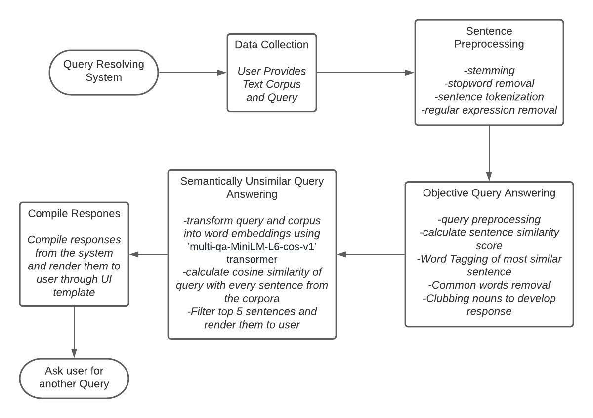
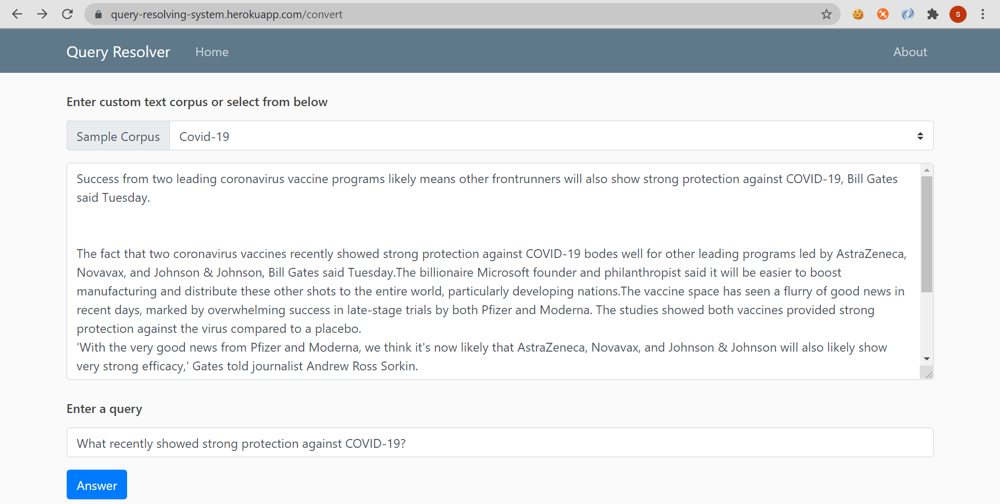
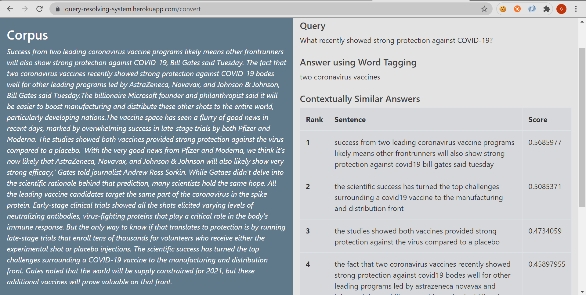

# QUERY RESOLVING SYSTEM
This webpage illustrates the application of natural language processing.
The user has to input a corpus with a query to the application and the apllication returns the most semantically and contextually similar answers. 
The web application has been deployed using heroku and is available at  
https://query-resolving-system.herokuapp.com/ 
## Description
The project basically aims to provide a context limited query answering system. 
Text preprocessing has been done using nltk library. 
Further nltk-word tagger has been used to answer one word queries. 
And 'multi-qa-MiniLM-L6-cos-v1' sentence transformer model has been used to return contextually similar answers 
## Usage
<ul>
<li>After visiting the home page user has to press the the link to visit the convert page</li>
<li>At the convert page the user can then either select a sample corpus or provide his custom corpus in the textarea</li>
<li>User is then required to input a query which would be resolved by the application</li>
<li>Application will return an objective answer and top 5 contextually similar answers along with their scores</li>
</ul>

## Flowchart Of Methodology

 
 
## I/O screenshots
### Input

 

### Output

## Authors
Suryansh Bhardwaj

## License
[MIT](https://choosealicense.com/licenses/mit/)

